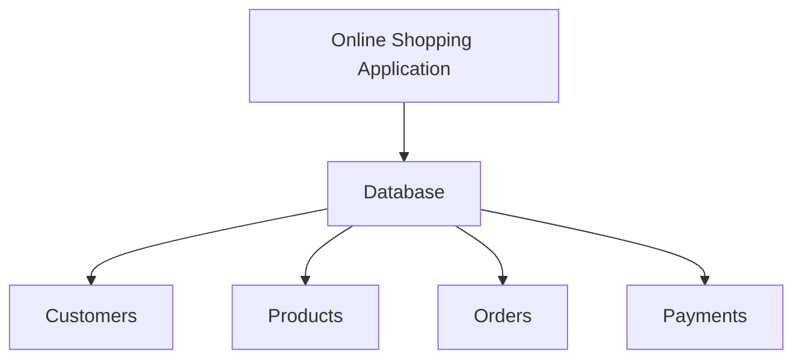
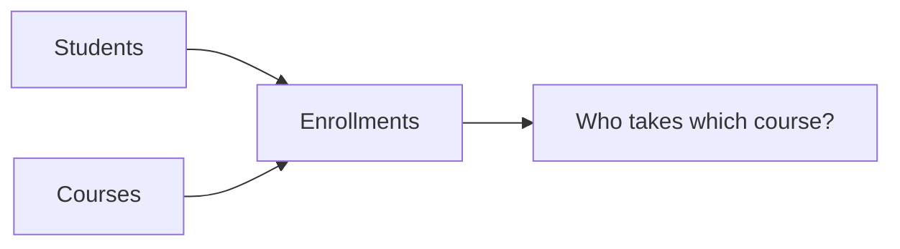
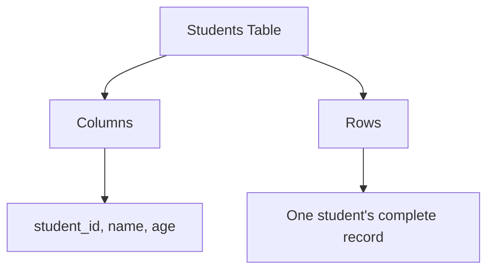
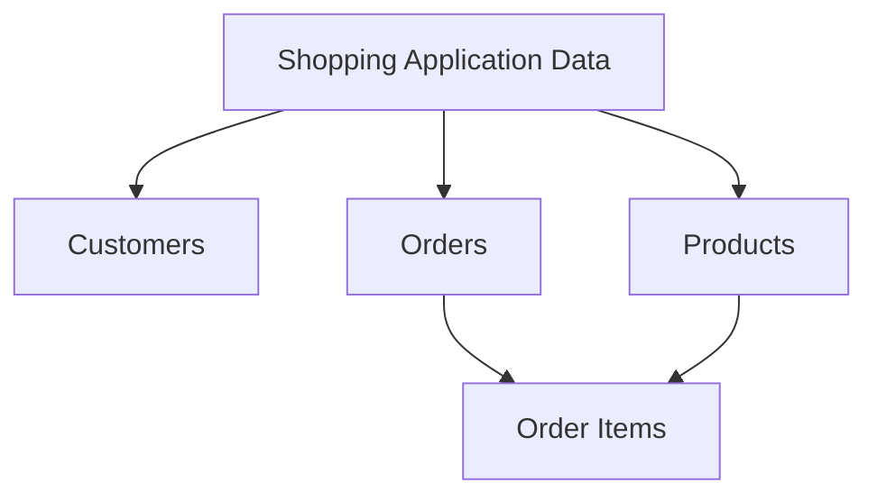
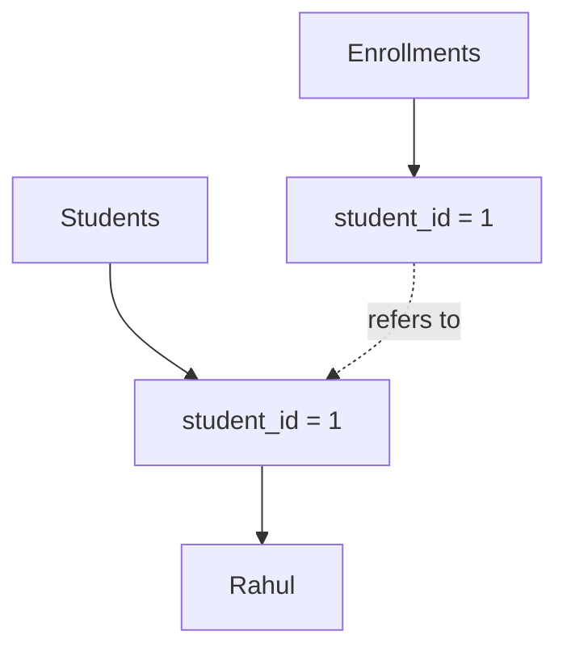
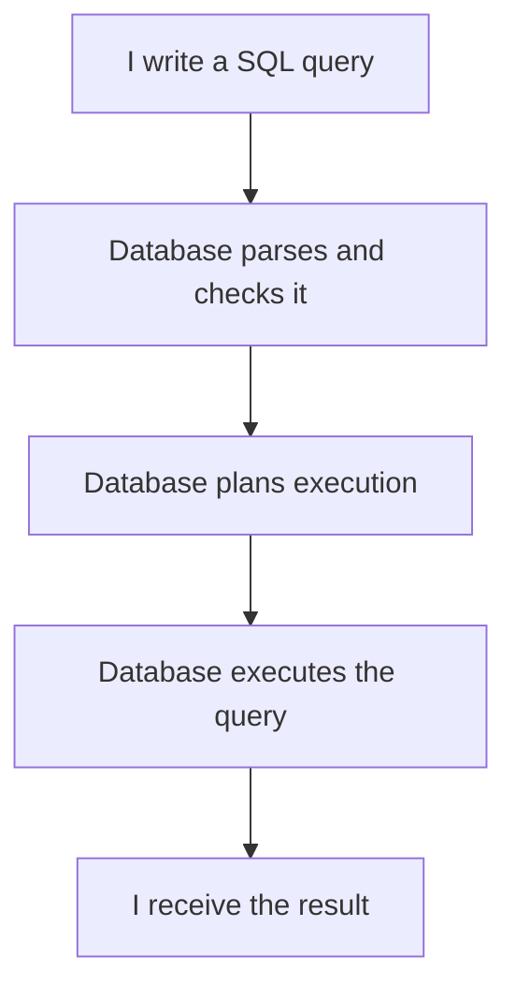
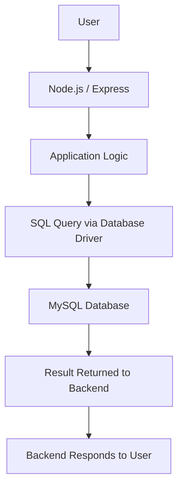
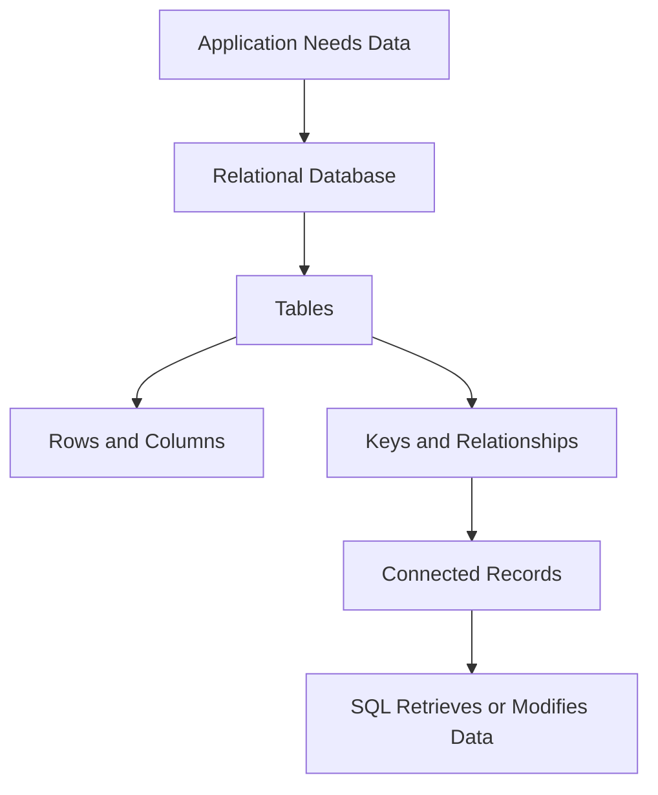

# Lesson 01: Understanding SQL & Relational Databases

## Why Am I Learning This?

I already know the basics of databases from MongoDB. I understand that applications need databases to store information and retrieve it whenever required.

Now I want to understand **relational databases and SQL** because I want to build backend applications that work with real-world data.

Imagine I'm building an online shopping application. It needs to store customers, products, orders, and payments.

Initially, this sounds simple. But then I start asking questions:

* How do I connect an order to the customer who placed it?
* What happens when one order contains multiple products?
* How do I avoid repeating the same customer information everywhere?
* How do I retrieve information stored across multiple tables?

These are not just questions about SQL syntax. They're questions about **how data should be organized in the first place**.

That's where I want to start.

---

## 01. What Is a Database?

A database is an organized collection of data that can be stored, accessed, and managed.

An online shopping application, for example, might need to store:

| Information | Example                |
| ----------- | ---------------------- |
| Customers   | Name, email, address   |
| Products    | Name, price, stock     |
| Orders      | Order date, customer   |
| Payments    | Amount, payment status |

All this information belongs to the same application, but each category represents something different.

A customer is not an order. An order is not a product. Each has its own information and purpose.



A database provides a way to organize and manage the information an application depends on.

However, different database systems organize data differently. To understand relational databases, I first want to compare them with something I already know: MongoDB.

---

## 02. How Is Data Organized?

### MongoDB: Documents

MongoDB stores records as documents, commonly represented using a JSON-like structure.

```json
{
  "name": "Rahul",
  "email": "rahul@example.com",
  "city": "Delhi"
}
```

Related documents are typically stored in collections.

### Relational Databases: Tables

A relational database organizes data into tables containing rows and columns.

| customer_id | name  | email                                         |
| ----------: | ----- | --------------------------------------------- |
|           1 | Rahul | [rahul@example.com](mailto:rahul@example.com) |
|           2 | Priya | [priya@example.com](mailto:priya@example.com) |

Both examples represent customer information. The difference is how the data is structured and how relationships are represented.

| MongoDB                                                | Relational Database                            |
| ------------------------------------------------------ | ---------------------------------------------- |
| Database contains collections                          | Database contains tables                       |
| Collections contain documents                          | Tables contain rows                            |
| Documents contain fields                               | Tables define columns                          |
| Relationships can use references or embedded documents | Relationships commonly use keys between tables |

This is a simplified comparison. MongoDB can represent relationships, and relational databases can store complex data too.

**My takeaway:** I already understand why applications need databases. Now I'm learning another way to organize data and represent relationships between records.

---

## 03. What Makes a Database Relational?

This is the central concept of this lesson.

Imagine I have a college application that stores students and courses.

**Students**

| student_id | name  |
| ---------: | ----- |
|          1 | Rahul |
|          2 | Priya |

**Courses**

| course_id | course_name |
| --------: | ----------- |
|       101 | Java        |
|       102 | SQL         |

These tables tell me which students and courses exist. But they don't tell me which student is enrolled in which course.

For that, I need to represent the relationship between them.

**Enrollments**

| student_id | course_id |
| ---------: | --------: |
|          1 |       101 |
|          1 |       102 |
|          2 |       102 |

Now I can understand that Rahul is enrolled in Java and SQL, while Priya is enrolled in SQL.



The `Enrollments` table connects students to courses using their IDs.

Notice that I don't need to repeat each student's name or each course's name in every enrollment record. I can refer to the corresponding records instead.

**A relational database organizes data into tables and provides a structured way to represent relationships between that data.**

That's the idea I want to understand before learning JOINs or database design.

---

## 04. Understanding Tables, Rows & Columns

Consider this `Students` table:

| student_id | name  | age |
| ---------: | ----- | --: |
|          1 | Rahul |  20 |
|          2 | Priya |  19 |
|          3 | Aman  |  21 |



### Table

A structure used to organize a particular category of data. Here, the table stores students.

### Column

Defines an attribute that each record can contain, such as `name` or `age`.

### Row

Represents one complete record. For example, `1, Rahul, 20` represents one student.

The distinction I want to remember:

* **Column:** What kind of information is stored?
* **Row:** What are the actual values for one record?
* **Table:** How are records of the same kind organized?

These three concepts will appear throughout the entire course, so I want them to feel natural before moving forward.

---

## 05. Why Not Store Everything in One Table?

Let's return to the shopping application.

Suppose I store customer and product information in a single table.

| customer_name | customer_email                                | product_name | order_id |
| ------------- | --------------------------------------------- | ------------ | -------: |
| Rahul         | [rahul@example.com](mailto:rahul@example.com) | Keyboard     |      501 |
| Rahul         | [rahul@example.com](mailto:rahul@example.com) | Mouse        |      501 |
| Priya         | [priya@example.com](mailto:priya@example.com) | Monitor      |      502 |

This might work for a small example, but problems appear as the application grows.

**Repeated information**

Rahul's name and email are stored multiple times.

**Updating data becomes harder**

If Rahul changes his email, I may need to update multiple rows. Missing one could leave inconsistent information.

**Different concepts get mixed together**

Customer details, order details, and product details have different purposes, but they're all stored in the same structure.

**The structure becomes harder to extend**

A customer can place multiple orders, and each order can contain multiple products. Representing all these situations in one table becomes awkward.

Instead, I can separate the different categories of information.



Each table has a specific responsibility:

* `Customers` stores customer details.
* `Orders` stores order details.
* `Products` stores product details.
* `Order Items` represents which products belong to which orders.

This is the beginning of good database design. I'll learn the rules and techniques for designing these tables properly in later lessons.

For now, I just need to understand **why separating related categories of data is useful**.

---

## 06. How Do Tables Identify and Connect Records?

If tables are separate, how does the database know which customer or student a record refers to?

Consider this table:

**Students**

| student_id | name  |
| ---------: | ----- |
|          1 | Rahul |
|          2 | Priya |

A name alone isn't always a reliable identifier because two students could have the same name.

I can use a unique identifier instead.

### Primary Key

A primary key uniquely identifies each row in a table.

Here, `student_id` can serve as the primary key.

### Foreign Key

A foreign key is a column, or a group of columns, that references a key in another table. A foreign key constraint can enforce the relationship by preventing references to nonexistent records.

For example, an enrollment can refer to a student using `student_id`.



The distinction is simple:

* **Primary key:** Identifies a record in its own table.
* **Foreign key:** Refers to a record through a key in another table, or sometimes the same table.

I'll learn how to define these keys and enforce their rules in the constraints lesson.

---

## 07. What Is SQL?

**SQL stands for Structured Query Language.**

It's the language I use to communicate with relational database systems such as MySQL.

With SQL, I can:

* Retrieve information.
* Insert new records.
* Update existing records.
* Delete records.
* Create and modify database structures.
* Work with transactions.

For example, imagine a table named `students`.

```sql
SELECT name
FROM students;
```

This query asks the database to return the `name` column from the `students` table.

I don't need to write a loop to visit every student and manually collect their names. I describe the result I want, and the database executes the query.

I'll learn `SELECT` properly in Lesson 03. For now, I want to recognize SQL as the language that lets me interact with the database.

---

## 08. SQL Is Declarative

This is an important concept for how I think about SQL.

In a typical procedural approach, I describe the steps needed to produce a result.

With declarative SQL, I describe the result I want, and the database determines how to execute the request.

For example:

```sql
SELECT name
FROM students;
```

I'm saying, "Give me the names of the students."

I'm not specifying how the database should scan its storage, locate every record, and collect the results.



The actual execution process is more involved, and I'll explore query execution and optimization later.

For now, the key idea is:

**I describe what data I need instead of manually implementing every step required to retrieve it.**

---

## 09. Where Does SQL Fit Into Backend Development?

I'm learning SQL because I want to build backend applications, not just run database commands.

Imagine a user signs up for an application built with Node.js and Express.

The backend receives the request, validates the information, and communicates with the database to save the new user.



Each part has a different responsibility:

* **Backend:** Handles requests, application logic, and communication with other systems.
* **SQL:** Expresses database operations.
* **Database:** Stores and manages data and executes queries.

In a real application, Node.js communicates with MySQL through a database driver or library.

I won't need to manually type every query into the terminal once I start integrating SQL into my backend projects. Learning the fundamentals first will help me understand what the backend is actually asking the database to do.

---

## 10. The Mental Model I Want to Keep

Let's bring the concepts together.



My understanding should now be:

1. An application needs a reliable way to store and manage information.
2. A relational database organizes information into tables.
3. Each table contains rows and columns.
4. Keys help identify records and connect related data.
5. SQL lets me retrieve, insert, update, and delete data, as well as manage database structures.
6. A backend application can use SQL to communicate with the database.

I don't need to memorize every definition word for word. I need to understand the ideas well enough to explain them in my own words.

---

## What I Learned

* [x] What a database is and why applications need one.
* [ ] How MongoDB documents differ from relational tables.
* [ ] What makes a database relational.
* [ ] The difference between tables, rows, and columns.
* [ ] Why applications separate customers, orders, and products.
* [ ] How primary keys and foreign keys help connect records.
* [ ] What SQL is and why it is declarative.
* [ ] How SQL fits into a Node.js backend.

## What's Next?

**Lesson 02 — Tables, Rows & Columns**

Now I'll stop discussing database concepts only in theory and start working with MySQL.

I'll learn how to:

* Create and select a database.
* Create tables and define columns.
* Choose basic data types.
* Insert records into a table.
* Inspect table structures and view stored data.
* Understand the difference between a table's structure and its contents.

My goal is to understand what each command does, why I need it, and how the database changes when I run it.

**Understand the data first. Understand the query second. Never blindly memorize commands.**
