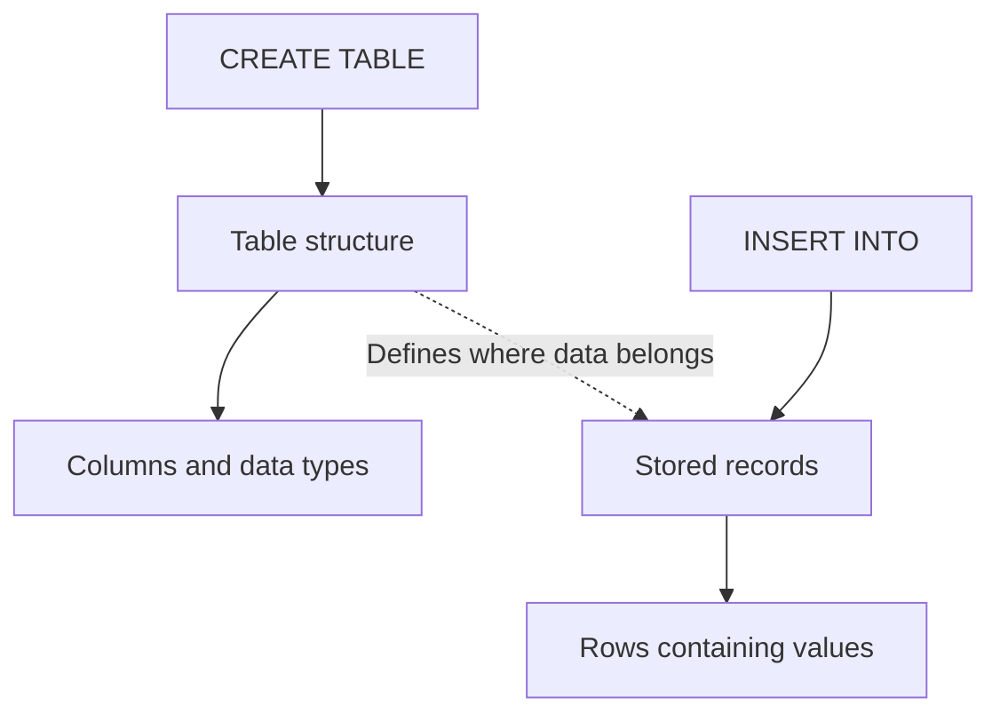
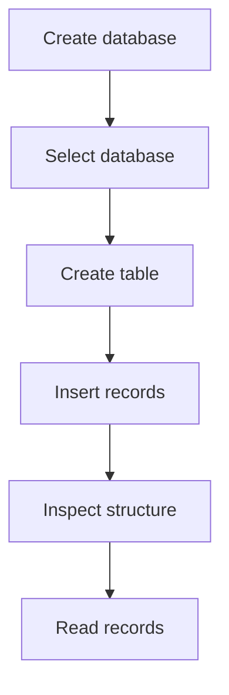

# Lesson 02 — Tables, Rows & Columns

## Why Am I Learning This?

I already know that SQL is used to work with relational databases. But before I start writing queries, I need to understand how information is actually organized inside a database.

Imagine I am building a school management system. The school needs to maintain information about students, courses, and which students are enrolled in which courses.

Where should I store all this information? Should everything go into one large table? How do I distinguish one student from another? And how will I organize the information so that I can retrieve it later?

To answer these questions, I first need to understand **databases, tables, rows, and columns**.

In this lesson, I will create a database, design a table, insert some sample records, and inspect what I have created.

I don't want to memorize SQL commands blindly. I want to understand what each command does and why I need it.

## What Am I Going to Learn?

* How a MySQL server, database, and table relate to one another.
* What tables, rows, columns, and cells represent.
* The difference between a table's structure and its data.
* Why columns need data types.
* How to create and select a database.
* How to create a table using `CREATE TABLE`.
* How to insert records using `INSERT INTO`.
* How to inspect a table's structure and contents.
* Why rerunning a SQL file can cause errors or duplicate records.

---

## 01. First, Understand the Hierarchy

Before writing SQL, I need to understand where everything lives.

MySQL manages databases, and each database can contain multiple tables. Each table organizes a particular kind of information.

For my school management system, the hierarchy could look like this:

```text
MySQL Server
│
└── school_management (Database)
    │
    ├── students (Table)
    │   └── Information about students
    │
    ├── courses (Table)
    │   └── Information about courses
    │
    └── enrollments (Table)
        └── Which students take which courses
```

Each level has a different purpose:

* **MySQL Server:** Runs and manages the database system.
* **Database:** Organizes related database objects.
* **Table:** Organizes a particular kind of information.
* **Column:** Defines an attribute of that information.
* **Row:** Represents one record in the table.
* **Cell:** Holds one value at the intersection of a row and a column.

For now, I will focus on one table. Once I understand its structure, working with multiple related tables will become easier.

## 02. What Exactly Is a Database?

A database is an organized collection of information that I can store, retrieve, and manage.

Imagine maintaining the details of hundreds of students in a plain text file. Finding a particular student, updating information, and keeping records consistent would become difficult as the amount of data increased.

A database gives me a structured way to manage that information.

However, a database is not the same thing as a table.

I can think of the database as a container that organizes related tables.

For example:

* `students` stores student information.
* `courses` stores course information.
* `enrollments` stores information about students taking courses.

Keeping these tables separate helps me organize different kinds of information without unnecessarily mixing everything together.

## 03. Creating My Database

To create a database in MySQL, I use `CREATE DATABASE`.

```sql
CREATE DATABASE IF NOT EXISTS school_management;
```

Let me understand the command:

* `CREATE DATABASE` tells MySQL to create a database.
* `IF NOT EXISTS` prevents an error if a database with that name already exists.
* `school_management` is the database name.
* `;` marks the end of the SQL statement.

Why use `IF NOT EXISTS`?

Because I might execute this command more than once while practising. If the database already exists, MySQL will leave it in place instead of trying to create another database with the same name.

One important detail: this statement does not clear or reset an existing database. It simply avoids creating it again.

## 04. Selecting My Database

Creating a database and selecting a database are two different operations.

Creating a database gives me a place to organize information. Selecting it tells MySQL which database I want to work with by default.

```sql
USE school_management;
```

I can verify which database is currently selected:

```sql
SELECT DATABASE();
```

Example output:

```text
+-------------------+
| DATABASE()        |
+-------------------+
| school_management |
+-------------------+
1 row in set
```

This tells me that `school_management` is my current database.

Why does this matter?

Because when I create a table, I need to make sure I am working in the intended database. Otherwise, I might receive an error or create a table in a different database than I expected.

---

## 05. What Is a Table?

A table organizes information into rows and columns.

Suppose I want to maintain student records. I could design a table with four columns:

* `id`
* `name`
* `age`
* `email`

Conceptually, the table looks like this:

```text
                  students
┌──────────┬──────────┬──────────┬──────────┐
│    id    │   name   │   age    │   email  │
├──────────┼──────────┼──────────┼──────────┤
│          │          │          │          │
│          │          │          │          │
└──────────┴──────────┴──────────┴──────────┘
```

At this stage, I am only planning the structure. The table does not contain any student records yet.

A table is not simply a visual grid. In MySQL, its definition specifies the columns, their data types, and any constraints that have been configured.

## 06. Understanding Rows, Columns, and Cells

This is the foundation I want to get right before moving forward.

Consider a table containing a few student records:

```text
+----+--------------+-----+---------------------------+
| id | name         | age | email                     |
+----+--------------+-----+---------------------------+
|  1 | John Cena    |  21 | john.cena@example.com     |
|  2 | Roman Reigns |  20 | roman.reigns@example.com  |
|  3 | Cody Rhodes  |  22 | cody.rhodes@example.com   |
+----+--------------+-----+---------------------------+
```

The names are illustrative sample data. The ages and email addresses are fictional.

Let's understand the structure.

### A row represents one record

The first row represents one student record:

```text
| 1 | John Cena | 21 | john.cena@example.com |
```

All the values in that row belong to the same record.

### A column represents one attribute

The `name` column contains the names associated with the records.

The `age` column contains their ages.

The `email` column contains their email addresses.

Each column has a defined purpose.

### A cell contains one value

The value `John Cena` is one cell in the table. It is located at the intersection of the first record's row and the `name` column.

### Visualizing the difference

```text
                 COLUMNS
          id      name       age
           │        │         │
        ┌──┼────────┼─────────┼───────┐
 ROW 1  │  1│ John Cena│  21   │  ...  │
        ├──┼────────┼─────────┼───────┤
 ROW 2  │  2│ Roman Reigns│ 20│  ...  │
        └──┴────────┴─────────┴───────┘
                    ↑
                  A cell
```

The drawing is conceptual rather than a literal MySQL output. The important idea is:

* Rows go horizontally.
* Columns go vertically.
* Cells contain individual values.

## 07. What Are Data Types?

MySQL needs to know what kind of values a column is designed to store. This is why I specify a data type when defining a column.

| Data type       | What it stores                             | Example                 |
| --------------- | ------------------------------------------ | ----------------------- |
| `INT`           | Whole numbers                              | `21`                    |
| `VARCHAR(100)`  | Variable-length text, up to 100 characters | `'John Cena'`           |
| `DECIMAL(10,2)` | Exact decimal numbers                      | `1250.50`               |
| `DATE`          | A calendar date                            | `'2026-10-10'`          |
| `DATETIME`      | A date and time                            | `'2026-10-10 14:30:00'` |

I don't need to memorize every data type right now. I need to understand why different kinds of information use different types.

For example:

* A student's name is text, so `VARCHAR` makes sense.
* An age is a whole number, so `INT` is suitable for this exercise.
* A fee amount might use `DECIMAL` because money needs appropriate decimal precision.

Choosing a suitable data type helps MySQL interpret and validate the values stored in a column.

### How a column definition comes together

```text
Column definition
       │
       ▼
   name VARCHAR(100)
   │    │       │
   │    │       └── Maximum character length
   │    └────────── Data type
   └─────────────── Column name
```

This is the basic anatomy of a column definition. I will use this same pattern when creating tables.

---

## 08. Creating My First Table

Now that I understand the structure, I can create the `students` table.

```sql
CREATE TABLE students (
    id INT,
    name VARCHAR(100),
    age INT,
    email VARCHAR(150)
);
```

Let me break down the statement.

`CREATE TABLE students` tells MySQL to create a table named `students`.

Inside the parentheses, I define four columns:

* `id INT` creates an integer column named `id`.
* `name VARCHAR(100)` creates a text column that can hold up to 100 characters.
* `age INT` creates an integer column named `age`.
* `email VARCHAR(150)` creates a text column that can hold up to 150 characters.

Commas separate the column definitions, and the semicolon ends the statement.

At this point, the table's structure has been created, but no records have been inserted.

Notice that I have not defined `id` as a primary key yet. I will learn about primary keys, uniqueness, and other constraints in a later lesson.

## 09. Structure Versus Data

This distinction is extremely important.

**Structure** describes how the table is defined: its columns, data types, and constraints.

**Data** is the actual information stored in its rows.

The relationship looks like this:



The commands have different purposes:

* `CREATE TABLE` defines the table.
* `INSERT INTO` adds records to it.

I can create a table with no records at all. The structure exists independently of whether any data has been inserted.

I can inspect the table's structure with:

```sql
DESCRIBE students;
```

Example output:

```text
+-------+--------------+------+-----+---------+-------+
| Field | Type         | Null | Key | Default | Extra |
+-------+--------------+------+-----+---------+-------+
| id    | int          | YES  |     | NULL    |       |
| name  | varchar(100) | YES  |     | NULL    |       |
| age   | int          | YES  |     | NULL    |       |
| email | varchar(150) | YES  |     | NULL    |       |
+-------+--------------+------+-----+---------+-------+
```

This is illustrative MySQL output for the table definition above. Since I have not defined any constraints, the columns currently allow `NULL` values and `id` is not a key.

The table exists, but it can still contain zero rows.

## 10. Inserting My First Row

To add a record to the table, I use `INSERT INTO`.

```sql
INSERT INTO students (id, name, age, email)
VALUES (1, 'John Cena', 21, 'john.cena@example.com');
```

Here is what each part does:

* `INSERT INTO students` identifies the table receiving the new record.
* `(id, name, age, email)` specifies the columns receiving values.
* `VALUES` introduces the values I want to insert.
* `(1, 'John Cena', 21, 'john.cena@example.com')` contains the values in the same order as the listed columns.

Text values are enclosed in single quotes, while integer values do not need quotes.

The name is sample data, and the age and email are fictional practice values.

### How the values map to columns

```text
Columns specified                 Values supplied
──────────────────                ───────────────
id                                1
name                              'John Cena'
age                               21
email                             'john.cena@example.com'
        │                                │
        └──────────────┬─────────────────┘
                       ▼
               One new table row
```

The order matters. The first value goes into the first listed column, the second into the second column, and so on.

This is why specifying the column names makes the query easier to read and maintain.

## 11. Adding More Rows

I can insert multiple records using one statement.

```sql
INSERT INTO students (id, name, age, email)
VALUES
    (2, 'Roman Reigns', 20, 'roman.reigns@example.com'),
    (3, 'Cody Rhodes', 22, 'cody.rhodes@example.com'),
    (4, 'Seth Rollins', 21, 'seth.rollins@example.com');
```

This statement inserts three additional records, assuming it succeeds.

The names are illustrative sample values, and the ages and email addresses are fictional.

The table would now contain these records:

```text
+----+--------------+-----+---------------------------+
| id | name         | age | email                     |
+----+--------------+-----+---------------------------+
|  1 | John Cena    |  21 | john.cena@example.com     |
|  2 | Roman Reigns |  20 | roman.reigns@example.com  |
|  3 | Cody Rhodes  |  22 | cody.rhodes@example.com   |
|  4 | Seth Rollins |  21 | seth.rollins@example.com  |
+----+--------------+-----+---------------------------+
```

This is an illustrative example of how MySQL might display the records.

Notice that each row contains four values, one for each column. The columns keep the information organized, while each row groups the values belonging to one record.

---

## 12. How Do I Inspect What I Created?

I should not have to guess whether my table exists or whether the records were inserted correctly. MySQL provides commands to inspect my work.

### Check the selected database

```sql
SELECT DATABASE();
```

This shows the database I am currently using.

### List the tables

```sql
SHOW TABLES;
```

This lists the tables in the selected database.

### Inspect the table structure

```sql
DESCRIBE students;
```

This displays the columns, data types, and other structural details.

### See the complete table definition

```sql
SHOW CREATE TABLE students;
```

This displays the SQL definition MySQL uses for the table, including its constraints and options.

### Read the stored records

```sql
SELECT * FROM students;
```

This retrieves every column from the table.

I will learn `SELECT` in detail in the next lesson. For now, I am using it to verify the records I inserted.

## 13. How Does the Whole Process Fit Together?

I want to understand the sequence instead of treating every SQL statement as an isolated command.



Each step has a different purpose:

1. **Create the database:** Establishes the container for my data.
2. **Select the database:** Chooses where I want to work.
3. **Create the table:** Defines the columns and their data types.
4. **Insert records:** Adds actual information.
5. **Inspect the structure:** Lets me verify the table definition.
6. **Read records:** Lets me check what has been stored.

The table must exist before I can insert records into it.

## 14. A Preview of Multiple Tables

A real school management system would need more than a `students` table.

For example, the school might have these tables:

```text
school_management
│
├── students
│   ├── id
│   └── name
│
├── courses
│   ├── course_id
│   └── course_name
│
└── enrollments
    ├── student_id
    └── course_id
```

Why not store every student's course names directly in the `students` table?

Because one student may enroll in multiple courses, and each course may have multiple students. Separating the information helps organize these facts without repeatedly storing all the course details in each student record.

The `enrollments` table can record which student takes which course.

Conceptually, the relationships look like this:


The diagram is a preview of how the tables could relate. The actual relationship rules will depend on the keys and constraints we define.

I will learn how to design these relationships properly in a later lesson. For now, I only need to understand why a database can contain several tables with different purposes.

## 15. What Happens If I Run My SQL File Again?

Since I am practising through the MySQL command line, I can execute a SQL file using `SOURCE`.

Suppose I run `playground.sql` and then run it again.

What happens depends on the statements inside it:

* `CREATE DATABASE IF NOT EXISTS school_management;` does not create the database again if it already exists.
* `CREATE TABLE students (...)` normally fails if the table already exists.
* The `INSERT` statements can insert duplicate records if they execute successfully and no constraint prevents them.

My current table has no primary key or uniqueness constraint, so MySQL can accept repeated IDs.

That is not a good design for a real school management system, but it demonstrates why constraints matter.

**I should never blindly rerun a SQL file without understanding what its statements will do.**

Before executing it again, I should check whether the table already exists and whether I have already inserted the sample records.

I should also avoid dropping tables casually. `DROP TABLE` removes a table and its stored data, so I should only use it when I intentionally want to remove that table.

## 16. My First Complete Experiment

I can put the commands from this lesson into my `playground.sql` file.

The following script is intended for a first run in a database where the `students` table does not already exist.

```sql
-- Create the database if it does not exist.
CREATE DATABASE IF NOT EXISTS school_management;

-- Select the database I want to work with.
USE school_management;

-- Create the table structure.
CREATE TABLE students (
    id INT,
    name VARCHAR(100),
    age INT,
    email VARCHAR(150)
);

-- Insert the first record.
INSERT INTO students (id, name, age, email)
VALUES (1, 'John Cena', 21, 'john.cena@example.com');

-- Insert three more records.
INSERT INTO students (id, name, age, email)
VALUES
    (2, 'Roman Reigns', 20, 'roman.reigns@example.com'),
    (3, 'Cody Rhodes', 22, 'cody.rhodes@example.com'),
    (4, 'Seth Rollins', 21, 'seth.rollins@example.com');

-- Inspect the table structure.
DESCRIBE students;

-- Read the stored records.
SELECT * FROM students;
```

The ages and email addresses are fictional practice data.

### What should I observe?

1. The database is created if it does not already exist.
2. MySQL selects `school_management`.
3. The `students` table is created with four columns.
4. Four records are inserted.
5. `DESCRIBE` displays the table's structure.
6. `SELECT *` displays the stored records.

If MySQL reports that the table already exists, I should stop and inspect its current state rather than immediately deleting anything.

## 17. How Should I Think Before Creating a Table?

Before writing `CREATE TABLE`, I should ask myself:

1. What kind of information am I storing?
2. What attributes should become columns?
3. Which data type makes sense for each column?
4. What should one row represent?
5. Will I need a unique identifier or other constraints?

For this example, one row represents one student record. The columns describe the information I want to store about that student.

A real school management system will eventually need separate tables for courses and enrollments. I will build that understanding gradually as I learn more about relationships, keys, and joins.

For now, I want to become comfortable with the basic structure.

## What I Learned

* [ ] A database organizes related database objects.
* [ ] A table contains columns and rows.
* [ ] A row represents one record.
* [ ] A column defines an attribute.
* [ ] A cell contains one value.
* [ ] Data types describe the kinds of values a column can store.
* [ ] `CREATE DATABASE` creates a database.
* [ ] `USE` selects a database.
* [ ] `CREATE TABLE` defines a table's structure.
* [ ] `INSERT INTO` adds records.
* [ ] `SHOW TABLES` lists tables in the selected database.
* [ ] `DESCRIBE` shows a table's structure.
* [ ] `SELECT *` retrieves all columns from a table.
* [ ] Rerunning SQL scripts can cause errors or duplicate records.

## What's Next?

In Lesson 03 — **SELECT: Reading Data**, I will learn how to retrieve information from a table properly.

I will practise selecting all columns, choosing specific columns, using aliases, and performing simple expressions in queries.

For now, the most important idea to remember is this:

**A table defines how information is organized. Its columns describe the attributes, and its rows contain the actual records.**
