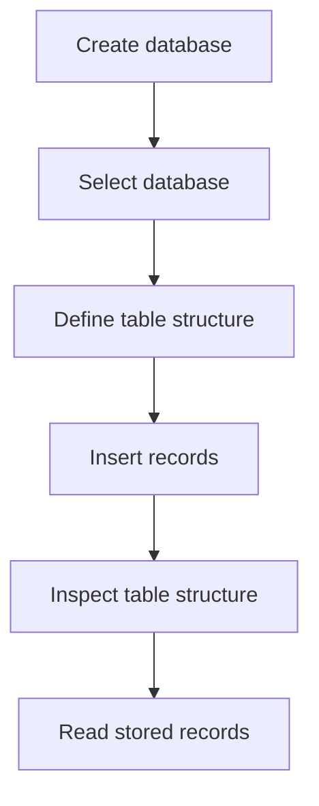

# Lesson 02 — Tables, Rows & Columns

## Why Am I Learning This?

I already know that SQL is used to work with relational databases. But before I start writing queries, I need to understand how information is actually organized inside a database.

Imagine I am building a school management system. The school needs to store information about students, courses, and enrollments.

Where should all this information go? Should I put everything into one large list? How would I distinguish one student from another? And how would I know which course a student has enrolled in?

To answer these questions, I first need to understand **databases, tables, rows, and columns**.

In this lesson, I will create a small database, design a table, insert some sample records, and inspect what I have created.

My goal is not to memorize SQL commands. I want to understand what each command does and why I need it.

## What Am I Going to Learn?

* How a MySQL server, database, and table relate to one another.
* What tables, rows, and columns represent.
* The difference between a table's structure and its data.
* How columns use data types.
* How to create and select a database.
* How to create a table using `CREATE TABLE`.
* How to insert records using `INSERT INTO`.
* How to inspect a table's structure and stored records.
* Why running the same SQL file multiple times can cause problems.

---

## 01. First, Understand the Hierarchy

Before writing SQL, I need to understand where my information will live.

MySQL organizes information using a hierarchy. A MySQL server manages databases, and each database can contain multiple tables.

For my school management example, the structure might look like this:

```text
MySQL Server
│
└── school_management (Database)
    │
    ├── students (Table)
    │   └── Student information
    │
    ├── courses (Table)
    │   └── Course information
    │
    └── enrollments (Table)
        └── Which students take which courses
```

Each level has a different purpose.

* **MySQL Server:** Runs and manages the database system.
* **Database:** Organizes related database objects.
* **Table:** Organizes a particular kind of information.
* **Column:** Defines an attribute of that information.
* **Row:** Stores one record.

For example, `students` stores student information, while `courses` stores course information.

I do not need to create all three tables immediately. I will start with one table and understand its structure first.

## 02. What Exactly Is a Database?

A database is an organized collection of information that I can store, retrieve, and manage.

Imagine maintaining the details of hundreds of students in a plain text file. Finding a particular student, updating their information, and keeping everything consistent would become difficult as the amount of data increased.

A database gives me a structured way to manage that information.

However, a database is not the same thing as a table.

Think of the database as a container for related information. Inside it, I can create separate tables for students, courses, teachers, and enrollments.

For this lesson, I will use a database named `school_management`.

## 03. Creating My Database

To create a database in MySQL, I use the `CREATE DATABASE` statement.

```sql
CREATE DATABASE IF NOT EXISTS school_management;
```

Let me understand each part:

* `CREATE DATABASE` tells MySQL to create a database.
* `IF NOT EXISTS` prevents an error from attempting to create a database with a name that already exists.
* `school_management` is the name of my database.
* `;` marks the end of the SQL statement.

Why use `IF NOT EXISTS`?

Because I might execute this command more than once while practising. If the database already exists, MySQL will leave it in place instead of trying to create another database with the same name.

An important detail: this statement does not clear, reset, or recreate an existing database. It simply avoids creating it again.

## 04. Selecting My Database

Creating a database and selecting a database are two different operations.

Creating a database gives me a place to organize information. Selecting it tells MySQL which database I want to work with by default.

```sql
USE school_management;
```

I can verify which database is currently selected:

```sql
SELECT DATABASE();
```

Example output:

```text
+-------------------+
| DATABASE()        |
+-------------------+
| school_management |
+-------------------+
1 row in set
```

This tells me that `school_management` is my current database.

Why does this matter?

Because when I create a table, I need to make sure I am working in the intended database. Otherwise, I might receive an error or create the table in a different database than I expected.

## 05. Before Creating a Table, Think About the Information

Now I want to store information about students.

Before writing SQL, I should decide what information I actually need.

For this first table, I will store:

* A student ID.
* The student's name.
* The student's age.
* The student's email address.

Conceptually, I am designing this structure:

```text
students
│
├── id
├── name
├── age
└── email
```

Notice that I have not written any SQL yet. I am first deciding how the information should be organized.

This is an important habit: **understand the information before designing the table that stores it.**

Later, when I learn about relationships, I will see why student details and course details usually belong in separate tables.

## 06. What Is a Column?

A column represents one attribute that I want to store for every record in a table.

In my `students` table:

* `id` identifies a student.
* `name` stores the student's name.
* `age` stores the student's age.
* `email` stores the student's email address.

Each column has a name and a data type. It can also have constraints that control which values are allowed.

A column describes what kind of information belongs in that position. It does not represent an individual student.

## 07. Understanding Data Types

MySQL needs to know what kind of values a column is intended to store.

That is why I specify a data type when creating a column.

| Data type       | What it stores                             | Example                 |
| --------------- | ------------------------------------------ | ----------------------- |
| `INT`           | Whole numbers                              | `21`                    |
| `VARCHAR(100)`  | Variable-length text, up to 100 characters | `'John Cena'`           |
| `DECIMAL(10,2)` | Exact decimal numbers                      | `1250.50`               |
| `DATE`          | A calendar date                            | `'2026-10-10'`          |
| `DATETIME`      | A date and time                            | `'2026-10-10 14:30:00'` |

I do not need to memorize every data type yet. I need to understand why different kinds of information use different types.

For example, a student's name is text, so `VARCHAR` makes sense. An age is a whole number, so `INT` is suitable for this exercise.

Choosing suitable data types helps MySQL interpret and validate the values stored in each column.

## 08. Creating My First Table

Now I know what information I want to store and which data types suit it.

I can create the table:

```sql
CREATE TABLE students (
    id INT,
    name VARCHAR(100),
    age INT,
    email VARCHAR(150)
);
```

Let me break down the statement.

`CREATE TABLE students` tells MySQL to create a table named `students`.

Inside the parentheses, I define four columns:

* `id INT` creates an integer column named `id`.
* `name VARCHAR(100)` creates a text column that can hold up to 100 characters.
* `age INT` creates an integer column named `age`.
* `email VARCHAR(150)` creates a text column that can hold up to 150 characters.

Commas separate the column definitions, and the semicolon ends the statement.

At this point, MySQL has a definition for the table. I have not inserted any student records yet.

Also, I have not defined `id` as a primary key. I will learn about primary keys and other constraints in a later lesson.

## 09. Structure and Data Are Different Things

This is one of the most important ideas in this lesson.

A table has a **structure** and can contain **data**.

The structure defines the columns and their data types. The data consists of the actual values stored in rows.

I can inspect the table structure with:

```sql
DESCRIBE students;
```

Example output:

```text
+-------+--------------+------+-----+---------+-------+
| Field | Type         | Null | Key | Default | Extra |
+-------+--------------+------+-----+---------+-------+
| id    | int          | YES  |     | NULL    |       |
| name  | varchar(100) | YES  |     | NULL    |       |
| age   | int          | YES  |     | NULL    |       |
| email | varchar(150) | YES  |     | NULL    |       |
+-------+--------------+------+-----+---------+-------+
```

This is illustrative MySQL output for the table definition above.

The table exists, but it can still contain zero rows.

```text
Table structure: Created
Records stored:  0
```

Creating a table does not automatically populate it with information. I need to insert records separately.

## 10. Inserting My First Row

To add a record to a table, I use `INSERT INTO`.

```sql
INSERT INTO students (id, name, age, email)
VALUES (1, 'John Cena', 21, 'john.cena@example.com');
```

Here is what each part does:

* `INSERT INTO students` identifies the table receiving the new record.
* `(id, name, age, email)` specifies the columns receiving values.
* `VALUES` introduces the values I want to insert.
* `(1, 'John Cena', 21, 'john.cena@example.com')` contains the values in the same order as the listed columns.

Text values are enclosed in single quotes, while integer values do not need quotes.

The name is used as sample data; the age and email are fictional practice values.

I have now added one row to the table.

### Why specify the column names?

Explicitly listing column names makes my query easier to understand and maintain. It also makes it clear which value belongs to which column.

For this reason, I will generally include the column names when inserting records.

## 11. Adding More Rows

I can insert multiple records in one statement.

```sql
INSERT INTO students (id, name, age, email)
VALUES
    (2, 'Roman Reigns', 20, 'roman.reigns@example.com'),
    (3, 'Cody Rhodes', 22, 'cody.rhodes@example.com'),
    (4, 'Seth Rollins', 21, 'seth.rollins@example.com');
```

This statement inserts three additional records, assuming the statement succeeds.

The names are sample values, and the ages and email addresses are fictional.

The table would now contain these records:

```text
+----+--------------+-----+--------------------------+
| id | name         | age | email                    |
+----+--------------+-----+--------------------------+
|  1 | John Cena    |  21 | john.cena@example.com    |
|  2 | Roman Reigns |  20 | roman.reigns@example.com |
|  3 | Cody Rhodes  |  22 | cody.rhodes@example.com  |
|  4 | Seth Rollins |  21 | seth.rollins@example.com |
+----+--------------+-----+--------------------------+
```

This is an example of how MySQL might display the stored records.

Each horizontal record is a row, and each vertical field is a column.

## 12. How Do I Inspect What I Created?

I should not have to guess whether my table exists or whether the records were inserted correctly. MySQL provides commands to inspect my work.

### Check the selected database

```sql
SELECT DATABASE();
```

This shows the database I am currently using.

### List the tables

```sql
SHOW TABLES;
```

This lists the tables in the selected database. The output depends on which tables already exist.

### Inspect a table's structure

```sql
DESCRIBE students;
```

This shows the columns, data types, and other structural details.

### See the complete table definition

```sql
SHOW CREATE TABLE students;
```

This shows the SQL definition MySQL uses for the table, including its constraints and options.

### Read the stored records

```sql
SELECT * FROM students;
```

This retrieves every column from the table.

I will learn `SELECT` in detail in the next lesson. For now, I am using it to verify the records I inserted.

## 13. How Do These Operations Fit Together?

I want to understand the overall process rather than treat each SQL command as an isolated instruction.



Each step has a different purpose:

1. **Create the database:** Establishes the container for my data.
2. **Select the database:** Chooses where I want to work.
3. **Create the table:** Defines the columns and their data types.
4. **Insert records:** Adds actual information.
5. **Inspect the structure:** Lets me verify the table definition.
6. **Read records:** Lets me check what has been stored.

The sequence matters because the table must exist before I can insert records into it.

## 14. What Happens If I Run My SQL File Again?

This matters because I am practising through the MySQL command line and can execute an entire SQL file using `SOURCE`.

Suppose I execute my `playground.sql` file and then execute it again.

What happens depends on the statements in the file:

* `CREATE DATABASE IF NOT EXISTS school_management;` will not create the database again if it already exists.
* `CREATE TABLE students (...)` will normally fail if the table already exists.
* The `INSERT` statements can add duplicate records if they execute successfully and no constraint prevents them.

My current table has no primary key or uniqueness constraint, so MySQL can accept repeated IDs. That is not a good design for a real student table, but it demonstrates why constraints matter.

**I should never blindly rerun a SQL file without understanding what its statements will do.**

Before executing the file again, I should check whether the table exists and whether I have already inserted the sample records.

I should also avoid dropping tables casually. `DROP TABLE` removes the table and its stored data, so I should only use it when I intentionally want to remove that table.

## 15. My First Complete Experiment

I can put the commands from this lesson into my `playground.sql` file.

The following script is intended for a first run in a database where the `students` table does not already exist.

```sql
-- Create the database if it does not exist.
CREATE DATABASE IF NOT EXISTS school_management;

-- Select the database I want to work with.
USE school_management;

-- Create the table structure.
CREATE TABLE students (
    id INT,
    name VARCHAR(100),
    age INT,
    email VARCHAR(150)
);

-- Insert the first record.
INSERT INTO students (id, name, age, email)
VALUES (1, 'John Cena', 21, 'john.cena@example.com');

-- Insert three more records.
INSERT INTO students (id, name, age, email)
VALUES
    (2, 'Roman Reigns', 20, 'roman.reigns@example.com'),
    (3, 'Cody Rhodes', 22, 'cody.rhodes@example.com'),
    (4, 'Seth Rollins', 21, 'seth.rollins@example.com');

-- Inspect the table structure.
DESCRIBE students;

-- Read the stored records.
SELECT * FROM students;
```

The names are sample data, not an indication that this database is about wrestling. The age and email values are fictional.

### What should I observe?

1. The database is created if it does not already exist.
2. MySQL selects `school_management`.
3. The `students` table is created with four columns.
4. Four records are inserted.
5. `DESCRIBE` displays the table's structure.
6. `SELECT *` displays the stored records.

If MySQL reports that the table already exists, I should stop and inspect its current state instead of immediately deleting anything.

## 16. How Should I Think Before Creating a Table?

Before writing `CREATE TABLE`, I should ask myself:

1. What kind of information am I storing?
2. What attributes should become columns?
3. Which data type makes sense for each column?
4. What should one row represent?
5. Will I need a unique identifier or other constraints?

For this example, one row represents one student record. The columns describe the information I want to store about that student.

A real school management system would also need separate tables for courses and enrollments. Those tables would become especially useful when I start learning relationships and `JOIN` queries.

For now, I want to understand the foundation before adding more complexity.

## What I Learned

* [ ] A database organizes related database objects.
* [ ] A table contains columns and rows.
* [ ] Columns define the attributes I want to store.
* [ ] Rows contain individual records.
* [ ] Data types describe the kinds of values a column can store.
* [ ] `CREATE DATABASE` creates a database.
* [ ] `USE` selects a database.
* [ ] `CREATE TABLE` defines a table's structure.
* [ ] `INSERT INTO` adds records.
* [ ] `SHOW TABLES` lists tables in the selected database.
* [ ] `DESCRIBE` shows a table's structure.
* [ ] `SELECT *` retrieves all columns from a table.
* [ ] Re-running SQL scripts can cause errors or insert duplicate records.

## What's Next?

In Lesson 03 — **SELECT: Reading Data**, I will learn how to retrieve information from a table properly.

I will practise selecting all columns, choosing specific columns, using aliases, and performing simple expressions in queries.

For now, the most important idea to remember is this:

**A table defines how information is organized. Its columns describe the attributes, and its rows contain the actual records.**
